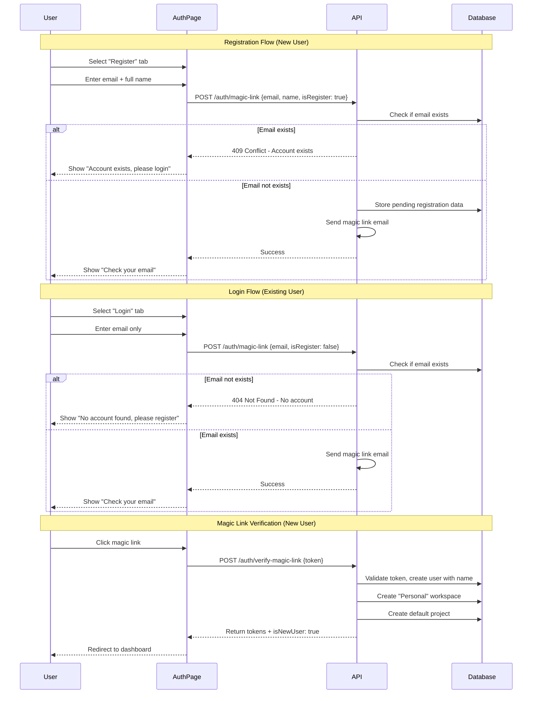
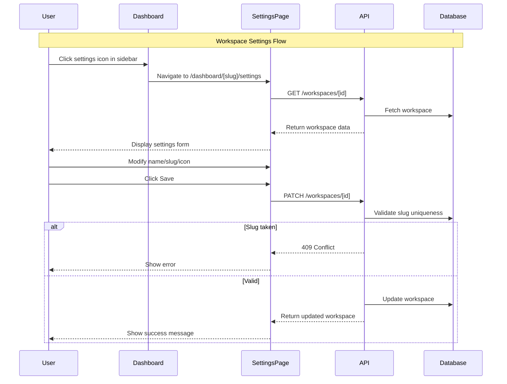

# Design Document: Auth & Workspace Enhancements

## Overview

This design document outlines the architecture and implementation details for enhancing the authentication flow and workspace management in Nottto. The changes include:

1. Separating login and registration flows on the auth page, requiring full name for new users
2. Creating a "Personal" workspace by default for new users
3. Adding a workspace settings page for managing workspace configuration
4. Implementing workspace icon selection for visual distinction

## Architecture





## Components and Interfaces

### API Endpoints

#### POST /auth/magic-link (Updated)

Request a magic link with support for login vs register distinction.

```typescript
// Request
interface MagicLinkRequest {
  email: string;
  name?: string; // Required for registration
  isRegister: boolean;
}

// Response (200 OK)
interface MagicLinkResponse {
  message: string;
  email: string; // Masked email for confirmation
}

// Error Responses
// 400 - Invalid email format or missing name for registration
// 404 - No account found (login mode only)
// 409 - Account already exists (register mode only)
// 429 - Rate limit exceeded
```

#### PATCH /workspaces/:id (Updated)

Update workspace settings including icon.

```typescript
// Request
interface UpdateWorkspaceRequest {
  name?: string;
  slug?: string;
  icon?: string; // Emoji or icon identifier
}

// Response (200 OK)
interface UpdateWorkspaceResponse {
  workspace: Workspace;
}

// Error Responses
// 400 - Invalid input
// 403 - Not workspace owner
// 404 - Workspace not found
// 409 - Slug already in use
```

### Web App Components

#### AuthPage Component (Updated)

Enhanced auth page with login/register toggle.

```typescript
interface AuthPageState {
  mode: "login" | "register";
  step: "form" | "confirmation" | "error";
  email: string;
  name: string; // For registration
  isLoading: boolean;
  error: string | null;
  canResend: boolean;
  resendCountdown: number;
}
```

#### WorkspaceSettingsPage Component (New)

Settings page for workspace configuration.

```typescript
// Route: /dashboard/[workspaceSlug]/settings
interface WorkspaceSettingsPageProps {
  params: {
    workspaceSlug: string;
  };
}

interface WorkspaceSettingsState {
  name: string;
  slug: string;
  icon: string;
  isLoading: boolean;
  isSaving: boolean;
  error: string | null;
  success: boolean;
}
```

#### IconPicker Component (New)

Reusable icon picker for workspace icons.

```typescript
interface IconPickerProps {
  selectedIcon: string;
  onSelect: (icon: string) => void;
}

// Curated list of workspace icons (emojis)
const WORKSPACE_ICONS = [
  "📁",
  "💼",
  "🏠",
  "🚀",
  "⭐",
  "💡",
  "🎯",
  "📊",
  "🔧",
  "🎨",
  "📱",
  "💻",
  "🌐",
  "📝",
  "🔬",
  "🎮",
  "📚",
  "🏢",
  "🌟",
  "⚡",
  "🔥",
  "💎",
  "🎪",
  "🌈",
];
```

### Services

#### MagicLinkService (Updated)

Enhanced to support login vs register distinction.

```typescript
interface MagicLinkService {
  requestMagicLink(
    email: string,
    isRegister: boolean,
    name?: string
  ): Promise<void>;
  verifyMagicLink(token: string): Promise<AuthResponse>;
}
```

#### WorkspaceService (Updated)

Enhanced to support icon field and default workspace creation.

```typescript
interface WorkspaceService {
  createDefaultWorkspace(userId: string): Promise<Workspace>;
  update(
    workspaceId: string,
    userId: string,
    data: UpdateWorkspaceInput
  ): Promise<Workspace>;
}
```

## Data Models

### Users Table (No Change)

The users table already has a nullable `name` field which will be populated during registration.

### Workspaces Table (Updated)

Add icon field to workspaces table.

```sql
ALTER TABLE workspaces ADD COLUMN icon VARCHAR(50) DEFAULT '📁';
```

### Drizzle Schema Update

```typescript
export const workspaces = pgTable("workspaces", {
  id: uuid("id").primaryKey().defaultRandom(),
  name: varchar("name", { length: 255 }).notNull(),
  slug: varchar("slug", { length: 255 }).unique().notNull(),
  icon: varchar("icon", { length: 50 }).default("📁").notNull(), // New field
  ownerId: uuid("owner_id")
    .references(() => users.id, { onDelete: "cascade" })
    .notNull(),
  createdAt: timestamp("created_at").defaultNow().notNull(),
  updatedAt: timestamp("updated_at").defaultNow().notNull(),
});
```

### Magic Link Tokens Table (Updated)

Add name field to store pending registration data.

```sql
ALTER TABLE magic_link_tokens ADD COLUMN name VARCHAR(255);
ALTER TABLE magic_link_tokens ADD COLUMN is_register BOOLEAN DEFAULT false;
```

### Drizzle Schema Update for Magic Link Tokens

```typescript
export const magicLinkTokens = pgTable(
  "magic_link_tokens",
  {
    id: uuid("id").primaryKey().defaultRandom(),
    email: varchar("email", { length: 255 }).notNull(),
    tokenHash: varchar("token_hash", { length: 255 }).notNull(),
    name: varchar("name", { length: 255 }), // New field for registration
    isRegister: boolean("is_register").default(false), // New field
    expiresAt: timestamp("expires_at").notNull(),
    createdAt: timestamp("created_at").defaultNow().notNull(),
    usedAt: timestamp("used_at"),
  },
  (table) => [
    index("idx_magic_link_tokens_email").on(table.email),
    index("idx_magic_link_tokens_expires_at").on(table.expiresAt),
  ]
);
```

### Workspace Type Update

```typescript
export interface Workspace {
  id: string;
  name: string;
  slug: string;
  icon: string; // New field
  ownerId: string;
  createdAt: Date;
  updatedAt: Date;
}

export interface UpdateWorkspaceInput {
  name?: string;
  slug?: string;
  icon?: string; // New field
}
```

## Correctness Properties

_A property is a characteristic or behavior that should hold true across all valid executions of a system—essentially, a formal statement about what the system should do. Properties serve as the bridge between human-readable specifications and machine-verifiable correctness guarantees._

### Property 1: Name Validation Rejects Empty Input

_For any_ string composed entirely of whitespace (including empty string), submitting it as a full name during registration SHALL be rejected with a validation error.
**Validates: Requirements 1.4**

### Property 2: Registration Creates User with Personal Workspace

_For any_ valid registration (valid email and non-empty name), after successful magic link verification, the system SHALL create a user with the provided name, a workspace named "Personal" with slug "personal", and a default project within that workspace.
**Validates: Requirements 1.5, 2.1, 2.2, 2.4**

### Property 3: Register with Existing Email Returns Conflict

_For any_ email address that already exists in the database, attempting to register with that email SHALL return a 409 Conflict error.
**Validates: Requirements 1.6**

### Property 4: Login with Non-Existent Email Returns Not Found

_For any_ email address that does not exist in the database, attempting to login with that email SHALL return a 404 Not Found error.
**Validates: Requirements 1.7**

### Property 5: Mode Switching Preserves Email

_For any_ email entered in the auth form, switching between login and register modes SHALL preserve the email value in the input field.
**Validates: Requirements 1.8**

### Property 6: Workspace Update Round-Trip

_For any_ valid workspace update (name, slug, or icon), saving the changes and then retrieving the workspace SHALL return the updated values.
**Validates: Requirements 3.5, 3.6, 4.5**

### Property 7: Duplicate Slug Returns Conflict

_For any_ workspace slug that is already in use by another workspace, attempting to update a workspace to use that slug SHALL return a 409 Conflict error.
**Validates: Requirements 3.7**

### Property 8: Settings Access Restricted to Owners

_For any_ user who is not the owner of a workspace, attempting to access or modify the workspace settings SHALL be denied with a 403 Forbidden error.
**Validates: Requirements 3.9**

### Property 9: New Workspace Has Default Icon

_For any_ newly created workspace, the workspace SHALL have a default icon value assigned.
**Validates: Requirements 4.2**

## Error Handling

### API Error Responses

| Error Code | Scenario                      | Response                                                                      |
| ---------- | ----------------------------- | ----------------------------------------------------------------------------- |
| 400        | Invalid email format          | `{ error: "Invalid email format" }`                                           |
| 400        | Missing name for registration | `{ error: "Full name is required for registration" }`                         |
| 400        | Empty/whitespace name         | `{ error: "Full name cannot be empty" }`                                      |
| 400        | Invalid slug format           | `{ error: "Slug must contain only lowercase letters, numbers, and hyphens" }` |
| 403        | Not workspace owner           | `{ error: "Only the owner can modify this workspace" }`                       |
| 404        | No account found (login)      | `{ error: "No account found with this email. Please register." }`             |
| 404        | Workspace not found           | `{ error: "Workspace not found" }`                                            |
| 409        | Account exists (register)     | `{ error: "An account with this email already exists. Please login." }`       |
| 409        | Slug already in use           | `{ error: "This slug is already in use" }`                                    |
| 429        | Rate limit exceeded           | `{ error: "Too many requests", retryAfter: <seconds> }`                       |

### Web App Error Handling

- Display user-friendly error messages with clear next steps
- For login/register errors, suggest the alternative action (login vs register)
- For slug conflicts, suggest alternative slugs
- Preserve form state on errors to avoid data loss

## Testing Strategy

### Unit Tests

1. **Name Validation**: Test empty string, whitespace-only strings, and valid names
2. **Email Preservation**: Test that email is preserved when toggling modes
3. **Icon Picker**: Test icon selection and preview functionality
4. **Slug Validation**: Test valid and invalid slug formats

### Property-Based Tests

Property-based tests will use `fast-check` library for TypeScript to verify correctness properties across many generated inputs.

1. **Property 1 (Name Validation)**: Generate whitespace strings and verify rejection
2. **Property 2 (Registration Flow)**: Generate valid registration data and verify user + workspace creation
3. **Property 3 (Register Conflict)**: Create user, then attempt registration with same email
4. **Property 4 (Login Not Found)**: Generate non-existent emails and verify 404 response
5. **Property 5 (Mode Switching)**: Generate emails and verify preservation across mode switches
6. **Property 6 (Workspace Update)**: Generate valid updates and verify round-trip consistency
7. **Property 7 (Slug Conflict)**: Create workspace with slug, attempt to update another to same slug
8. **Property 8 (Owner Access)**: Generate non-owner users and verify access denial
9. **Property 9 (Default Icon)**: Create workspaces and verify default icon assignment

### Integration Tests

1. **Full Registration Flow**: Register → Magic link → Verify → User + Personal workspace created
2. **Full Login Flow**: Login → Magic link → Verify → Session created
3. **Settings Update Flow**: Navigate to settings → Modify → Save → Verify changes
4. **Icon Selection Flow**: Open picker → Select icon → Save → Verify in sidebar

### E2E Tests

1. **New User Journey**: Register with name → Verify email → Land on Personal workspace
2. **Workspace Settings**: Navigate to settings → Change name/icon → Verify changes persist
3. **Login vs Register Toggle**: Toggle between modes → Verify correct fields shown
