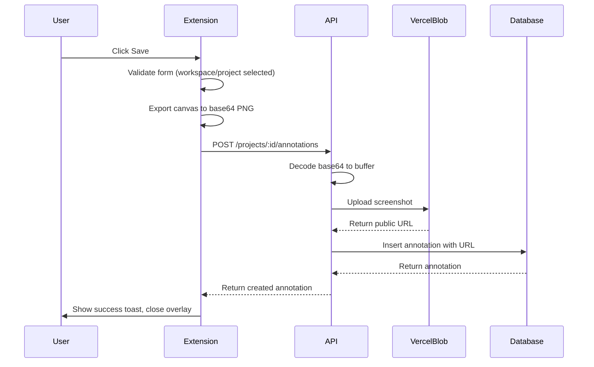

# Design Document: Extension Annotation Creation

## Overview

This design describes how the Chrome extension creates and saves annotations to the backend API with Vercel Blob storage for screenshots. The flow captures a screenshot, allows the user to annotate it, then saves the final image and metadata to the selected project.

## Architecture



## Components and Interfaces

### Extension Components

#### actions.ts - saveTask function (existing, to be updated)

```typescript
export async function saveTask(): Promise<void> {
  const state = getState();
  const { cleanupOverlay } = await import("./overlay");

  // Validate form
  const validation = validateForm();
  if (!validation.valid) {
    showToast(validation.errors[0], "error");
    return;
  }

  const formData = getFormData();

  // Disable save button
  const saveBtn = document.getElementById("bf-save-btn") as HTMLButtonElement;
  if (saveBtn) {
    saveBtn.disabled = true;
    saveBtn.textContent = "Saving...";
  }

  // Export canvas at original resolution
  state.fabricCanvas?.discardActiveObject();
  state.fabricCanvas?.renderAll();
  const multiplier = 1 / state.canvasScale;
  const annotatedImageDataUrl = state.fabricCanvas?.toDataURL({
    format: "png",
    multiplier: multiplier,
  });

  try {
    await createAnnotation({
      projectId: formData.projectId!,
      title: formData.title || "Untitled Annotation",
      description: formData.description || undefined,
      type: formData.type || undefined,
      priority: formData.priority || undefined,
      pageUrl: state.pageUrl,
      pageTitle: state.pageTitle,
      screenshotAnnotatedBase64: annotatedImageDataUrl,
    });

    showToast("Annotation saved successfully!");
    setTimeout(cleanupOverlay, 1500);
  } catch (error) {
    console.error("Nottto: Save failed", error);
    showToast("Failed to save annotation", "error");

    if (saveBtn) {
      saveBtn.disabled = false;
      saveBtn.textContent = "Save";
    }
  }
}
```

#### api/annotations.ts - Updated interface

```typescript
export interface CreateAnnotationData {
  projectId: string;
  title: string;
  description?: string;
  type?: string;
  priority?: string;
  pageUrl: string;
  pageTitle: string;
  screenshotAnnotatedBase64?: string;
}
```

### API Components

#### services/upload.ts - New base64 upload function

```typescript
export async function uploadBase64Screenshot(
  base64Data: string,
  userId: string
): Promise<{ url: string }> {
  // Validate and parse data URL
  const matches = base64Data.match(
    /^data:image\/(png|jpeg|gif|webp);base64,(.+)$/
  );
  if (!matches) {
    throw new HTTPException(400, { message: "Invalid base64 image format" });
  }

  const [, mimeType, base64Content] = matches;
  const buffer = Buffer.from(base64Content, "base64");

  // Validate size (10MB limit)
  if (buffer.length > 10 * 1024 * 1024) {
    throw new HTTPException(413, { message: "File size exceeds 10MB limit" });
  }

  // Generate filename and upload
  const timestamp = Date.now();
  const filename = `screenshots/${userId}/${timestamp}.${mimeType}`;

  const blob = await put(filename, buffer, {
    access: "public",
    addRandomSuffix: true,
    contentType: `image/${mimeType}`,
  });

  return { url: blob.url };
}
```

#### services/annotations.ts - Updated create function

```typescript
export async function create(
  projectId: string,
  userId: string,
  data: CreateAnnotationInput & { screenshotAnnotatedBase64?: string }
): Promise<Annotation> {
  // Check project access
  const hasAccess = await checkProjectAccess(projectId, userId);
  if (!hasAccess) {
    throw new HTTPException(403, { message: "Access denied to this project" });
  }

  // Process base64 screenshot if provided
  let screenshotAnnotatedUrl = data.screenshotAnnotated;
  if (data.screenshotAnnotatedBase64) {
    const uploadResult = await uploadBase64Screenshot(
      data.screenshotAnnotatedBase64,
      userId
    );
    screenshotAnnotatedUrl = uploadResult.url;
  }

  const [newAnnotation] = await db
    .insert(annotations)
    .values({
      projectId,
      userId,
      title: data.title,
      description: data.description || null,
      type: data.type || null,
      priority: data.priority || null,
      pageUrl: data.pageUrl || null,
      pageTitle: data.pageTitle || null,
      screenshotAnnotated: screenshotAnnotatedUrl || null,
    })
    .returning();

  return mapAnnotation(newAnnotation);
}
```

### Schema Updates

#### packages/shared/src/schemas/index.ts

```typescript
export const createAnnotationSchema = z.object({
  title: z.string().min(1, "Title is required").max(255),
  description: z.string().max(5000).optional(),
  type: annotationTypeSchema.optional(),
  priority: annotationPrioritySchema.optional(),
  pageUrl: z.string().url("Invalid URL").optional().or(z.literal("")),
  pageTitle: z.string().max(255).optional(),
  screenshotAnnotated: z.string().url("Invalid URL").optional(),
  screenshotAnnotatedBase64: z.string().optional(),
});
```

## Data Models

### Annotation Record (existing)

| Field               | Type         | Description                              |
| ------------------- | ------------ | ---------------------------------------- |
| id                  | UUID         | Primary key                              |
| projectId           | UUID         | Foreign key to projects                  |
| userId              | UUID         | Foreign key to users                     |
| title               | VARCHAR(255) | Annotation title                         |
| description         | TEXT         | Optional description                     |
| type                | VARCHAR(50)  | bug, improvement, question               |
| priority            | VARCHAR(50)  | urgent, high, medium, low                |
| pageUrl             | TEXT         | URL where annotation was created         |
| pageTitle           | VARCHAR(255) | Page title                               |
| screenshotAnnotated | TEXT         | Vercel Blob URL for annotated screenshot |
| createdAt           | TIMESTAMP    | Creation timestamp                       |
| updatedAt           | TIMESTAMP    | Last update timestamp                    |

### CreateAnnotationInput (updated)

```typescript
interface CreateAnnotationInput {
  title: string;
  description?: string;
  type?: "bug" | "improvement" | "question";
  priority?: "urgent" | "high" | "medium" | "low";
  pageUrl?: string;
  pageTitle?: string;
  screenshotAnnotated?: string; // Direct URL (backwards compat)
  screenshotAnnotatedBase64?: string; // Base64 data URL from extension
}
```

## Correctness Properties

_A property is a characteristic or behavior that should hold true across all valid executions of a system—essentially, a formal statement about what the system should do. Properties serve as the bridge between human-readable specifications and machine-verifiable correctness guarantees._

### Property 1: Base64 Screenshot Upload Produces Valid URL

_For any_ valid base64 PNG/JPEG/GIF/WebP data URL under 10MB, uploading via the API should produce a valid HTTPS URL that can be fetched.

**Validates: Requirements 1.1, 1.4, 3.1, 3.3**

### Property 2: Form Validation Blocks Invalid Submissions

_For any_ form state where workspaceId is null OR projectId is null, the validateForm function should return valid: false with appropriate error messages.

**Validates: Requirements 2.1, 2.2**

### Property 3: Annotation Data Persistence

_For any_ valid annotation creation request, all provided fields (title, description, type, priority, pageUrl, pageTitle) should be retrievable from the created annotation record.

**Validates: Requirements 2.3, 2.4, 4.3**

### Property 4: Duplicate Submission Prevention

_For any_ save operation in progress (button disabled), additional clicks on the save button should have no effect.

**Validates: Requirements 5.1, 5.2**

## Error Handling

| Error Condition        | HTTP Status  | User Message                                                   |
| ---------------------- | ------------ | -------------------------------------------------------------- |
| No workspace selected  | N/A (client) | "Please select a workspace"                                    |
| No project selected    | N/A (client) | "Please select a project"                                      |
| Invalid base64 format  | 400          | "Invalid base64 image format"                                  |
| File too large (>10MB) | 413          | "File size exceeds 10MB limit"                                 |
| Invalid image type     | 400          | "Invalid file type. Only PNG, JPEG, GIF, and WebP are allowed" |
| Project access denied  | 403          | "Access denied to this project"                                |
| Upload failed          | 500          | "Failed to upload file"                                        |
| Network error          | N/A          | "Failed to save annotation"                                    |

## Testing Strategy

### Unit Tests

- Test `validateForm()` with various form states (missing workspace, missing project, valid)
- Test base64 parsing regex with valid and invalid data URLs
- Test file size validation with boundary cases

### Property-Based Tests

Using a property-based testing library (e.g., fast-check for TypeScript):

1. **Base64 Upload Property**: Generate random valid PNG base64 strings, verify upload returns valid URL
2. **Form Validation Property**: Generate random form states, verify validation correctly identifies invalid states
3. **Data Persistence Property**: Generate random annotation data, verify all fields round-trip through create/get

### Integration Tests

- End-to-end test: Extension saves annotation → API processes → Dashboard displays
- Error handling: Verify error toasts appear for various failure modes
