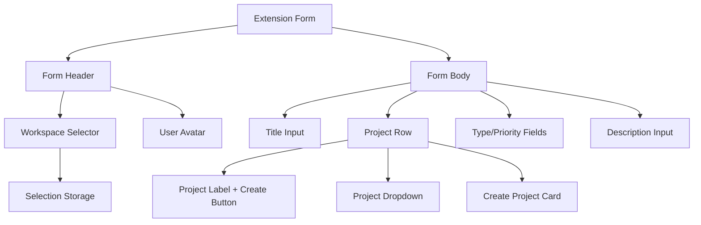

# Design Document: Extension Form Refinements

## Overview

This design document outlines the implementation approach for refining the Chrome extension annotation form UI. The changes improve workspace selection UX, streamline the form layout, and enhance visual consistency across form elements.

## Architecture

The refinements primarily affect the following components:

- `workspace-selector.ts` - Auto-selection and persistence logic
- `project-selector.ts` - Button relocation and form styling
- `overlay.ts` - Form HTML structure changes
- `form-header.ts` - Header layout adjustments
- CSS styles in `input.css` - Visual styling updates



## Components and Interfaces

### Workspace Selector Component

The workspace selector will be enhanced with auto-selection logic:

```typescript
// workspace-selector.ts modifications

/**
 * Initialize the workspace selector with auto-selection support
 * - If saved selection exists and is valid, restore it
 * - Otherwise, auto-select the first available workspace
 */
export async function initWorkspaceSelector(): Promise<void> {
  // ... fetch workspaces

  // Try to restore previous selection
  const savedSelection = await loadSelection();
  if (savedSelection.workspaceId) {
    const exists = workspaces.some((w) => w.id === savedSelection.workspaceId);
    if (exists) {
      // Restore saved selection
      select.value = savedSelection.workspaceId;
      selectedWorkspaceId = savedSelection.workspaceId;
      await initProjectSelector(savedSelection.workspaceId);
      return;
    }
  }

  // Auto-select first workspace if no valid saved selection
  if (workspaces.length > 0) {
    const firstWorkspace = workspaces[0];
    select.value = firstWorkspace.id;
    selectedWorkspaceId = firstWorkspace.id;
    await saveWorkspaceSelection(firstWorkspace.id);
    await initProjectSelector(firstWorkspace.id);
  }
}
```

### Project Row Layout

The project row will be restructured to place the create button next to the label:

```html
<!-- New project row structure -->
<div
  class="flex items-start gap-3 py-3 border-b border-gray-100"
  id="bf-project-row"
>
  <div class="w-5 h-5 text-gray-400 flex-shrink-0 mt-0.5">{folderIcon}</div>
  <div
    class="w-22 text-sm text-bf-secondary flex-shrink-0 flex items-center gap-1"
  >
    Project
    <button
      id="bf-create-project-btn"
      class="bf-create-btn-inline"
      title="Create new project"
      disabled
    >
      {plusIcon}
    </button>
  </div>
  <div class="flex-1 text-sm text-bf-primary" id="bf-project-container">
    <select id="bf-project-select" class="bf-select w-full" disabled>
      <option value="">Select workspace first</option>
    </select>
    <!-- Create Project Card (hidden by default) -->
    <div id="bf-create-project-form" class="bf-create-project-card hidden">
      <input
        type="text"
        id="bf-new-project-name"
        placeholder="Project name"
        class="bf-input-compact"
      />
      <div class="flex gap-2 mt-2">
        <button id="bf-cancel-create-project" class="bf-btn-sm secondary">
          Cancel
        </button>
        <button id="bf-confirm-create-project" class="bf-btn-sm primary">
          Create
        </button>
      </div>
    </div>
  </div>
</div>
```

### CSS Styling Updates

```css
/* Inline create button (next to Project label) */
.bf-create-btn-inline {
  @apply w-4 h-4 p-0 rounded flex items-center justify-center;
  @apply text-gray-400 hover:text-gray-600 hover:bg-gray-100;
  @apply transition-colors duration-150;
  @apply disabled:opacity-50 disabled:cursor-not-allowed;
}

.bf-create-btn-inline svg {
  @apply w-3 h-3;
}

/* Create project card styling */
.bf-create-project-card {
  @apply mt-3 p-3 bg-gray-50 rounded-lg border border-gray-200;
}

/* Compact input for project name */
.bf-input-compact {
  @apply w-full px-2 py-1.5 text-sm border border-gray-200 rounded;
  @apply bg-white focus:outline-none focus:ring-1 focus:ring-blue-500 focus:border-blue-500;
}

/* Small action buttons */
.bf-btn-sm {
  @apply text-xs py-1 px-2 rounded font-medium;
  @apply transition-colors duration-150;
}

.bf-btn-sm.secondary {
  @apply bg-gray-100 text-gray-600 hover:bg-gray-200;
}

.bf-btn-sm.primary {
  @apply bg-blue-500 text-white hover:bg-blue-600;
}

/* Title input - larger font */
#bf-title-input {
  @apply text-2xl font-serif;
}

/* Description input - transparent background until focused */
#bf-description-input {
  @apply bg-transparent border border-gray-200 rounded-lg;
  @apply focus:bg-white focus:border-gray-300;
}
```

## Data Models

### Selection Storage (Existing)

The existing `SelectionData` interface remains unchanged:

```typescript
interface SelectionData {
  workspaceId: string | null;
  projectId: string | null;
  timestamp: number;
}
```

The storage mechanism already supports workspace persistence. The enhancement is in the initialization logic that uses this data.

## Correctness Properties

_A property is a characteristic or behavior that should hold true across all valid executions of a system—essentially, a formal statement about what the system should do. Properties serve as the bridge between human-readable specifications and machine-verifiable correctness guarantees._

### Property 1: Workspace Initialization Correctness

_For any_ list of workspaces and any saved selection state, the workspace selector initialization SHALL:

- Select the saved workspace if it exists in the list
- Auto-select the first workspace if no valid saved selection exists
- Trigger project loading for the selected workspace

**Validates: Requirements 1.1, 1.2, 1.3, 2.2, 2.3**

### Property 2: Workspace Selection Persistence

_For any_ workspace selection action, the Selection_Storage SHALL contain the selected workspace ID after the selection is made.

**Validates: Requirements 2.1**

## Error Handling

| Error Scenario                   | Handling Strategy                                        |
| -------------------------------- | -------------------------------------------------------- |
| No workspaces available          | Display "No workspaces" message with link to create one  |
| Saved workspace no longer exists | Fall back to auto-selecting first available workspace    |
| Storage read/write failure       | Log error, continue with default behavior (no selection) |
| Project creation fails           | Show error toast, keep form open for retry               |

## Testing Strategy

### Unit Tests

Unit tests will verify specific examples and edge cases:

1. **Workspace auto-selection**: Test that first workspace is selected when no saved selection
2. **Workspace restoration**: Test that saved workspace is restored when valid
3. **Fallback behavior**: Test fallback to first workspace when saved selection is invalid
4. **DOM structure**: Verify create button is positioned next to Project label
5. **Form card structure**: Verify create project form has card wrapper with correct elements
6. **Reported by removal**: Verify the reported by row is not present in DOM
7. **Placeholder text**: Verify description input has helpful placeholder
8. **Title font size**: Verify title input has larger font class applied

### Property-Based Tests

Property-based tests will use fast-check to verify universal properties:

1. **Workspace initialization property**: Generate random workspace lists and saved selections, verify correct initialization behavior
2. **Persistence property**: Generate random workspace selections, verify storage is updated correctly

### Test Configuration

- Property tests: Minimum 100 iterations per property
- Test framework: Jest with fast-check for property-based testing
- Tag format: **Feature: extension-form-refinements, Property {number}: {property_text}**
