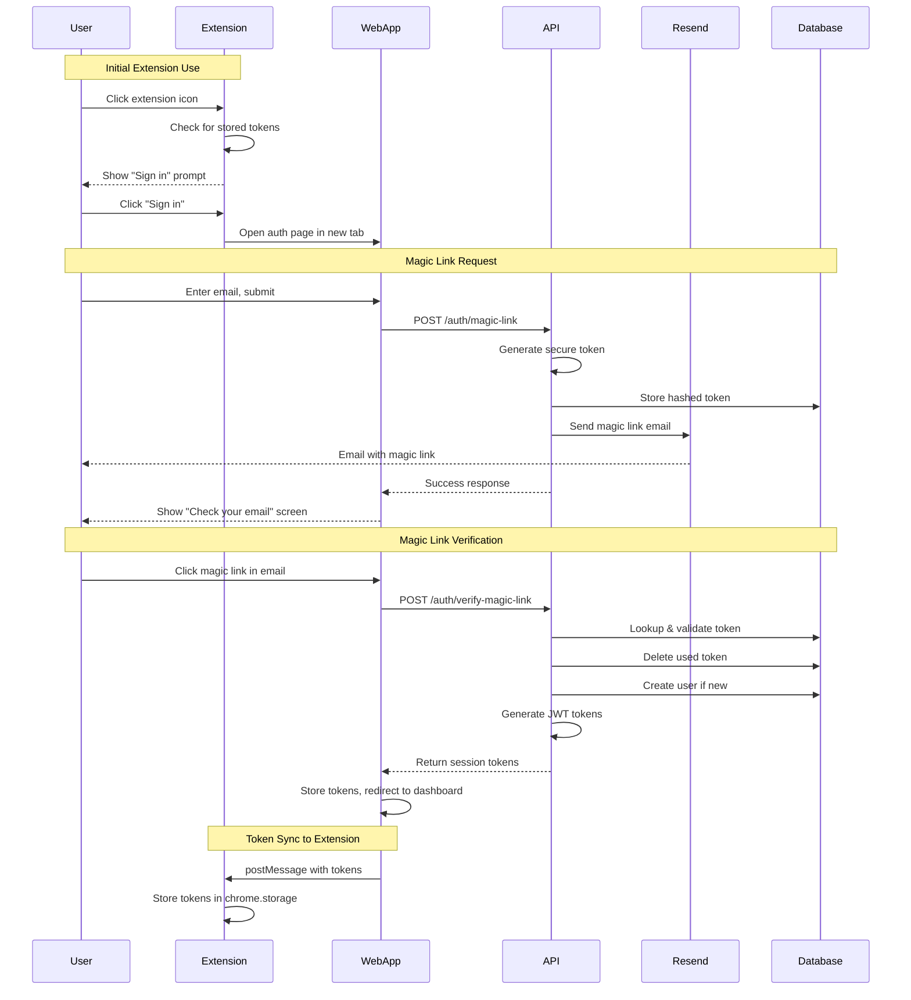

# Design Document: Magic Link Authentication

## Overview

This design document outlines the architecture and implementation details for passwordless magic link authentication in Nottto. The system enables users to authenticate by receiving a secure, time-limited link via email, eliminating the need for passwords. The implementation spans three applications: the Chrome extension, the Next.js web app, and the Hono API backend.

## Architecture



## Components and Interfaces

### API Endpoints

#### POST /auth/magic-link

Request a magic link to be sent to the provided email.

```typescript
// Request
interface MagicLinkRequest {
  email: string;
}

// Response (200 OK)
interface MagicLinkResponse {
  message: string;
  email: string; // Masked email for confirmation
}

// Error Responses
// 400 - Invalid email format
// 429 - Rate limit exceeded (includes Retry-After header)
// 500 - Email delivery failed
```

#### POST /auth/verify-magic-link

Verify a magic link token and issue session tokens.

```typescript
// Request
interface VerifyMagicLinkRequest {
  token: string;
}

// Response (200 OK)
interface VerifyMagicLinkResponse {
  user: User;
  tokens: {
    accessToken: string;
    refreshToken: string;
  };
  isNewUser: boolean;
}

// Error Responses
// 400 - Missing token
// 401 - Invalid or expired token
// 410 - Token already used
```

### Web App Components

#### AuthPage Component

Simplified auth page with email-only input.

```typescript
interface AuthPageState {
  step: "email" | "confirmation" | "verifying" | "error";
  email: string;
  isLoading: boolean;
  error: string | null;
  canResend: boolean;
  resendCountdown: number;
}
```

#### VerifyPage Component

Handles magic link callback and token verification.

```typescript
// Route: /auth/verify?token=<token>
interface VerifyPageProps {
  searchParams: {
    token?: string;
  };
}
```

### Extension Components

#### Auth State Manager

Manages authentication state in the extension.

```typescript
interface ExtensionAuthState {
  isAuthenticated: boolean;
  accessToken: string | null;
  refreshToken: string | null;
  user: User | null;
}

// Storage keys in chrome.storage.local
const AUTH_STORAGE_KEYS = {
  ACCESS_TOKEN: "nottto_access_token",
  REFRESH_TOKEN: "nottto_refresh_token",
  USER: "nottto_user",
};
```

#### Auth Prompt UI

Displayed when user is not authenticated.

```typescript
interface AuthPromptProps {
  onSignIn: () => void; // Opens web app auth page
}
```

### Services

#### MagicLinkService (API)

Handles magic link generation and verification.

```typescript
interface MagicLinkService {
  requestMagicLink(email: string): Promise<void>;
  verifyMagicLink(token: string): Promise<AuthResponse>;
}
```

#### ResendEmailService (API)

Handles email delivery via Resend.

```typescript
interface EmailService {
  sendMagicLinkEmail(email: string, magicLinkUrl: string): Promise<void>;
}
```

#### RateLimiter (API)

Implements rate limiting for magic link requests.

```typescript
interface RateLimiter {
  checkLimit(email: string): Promise<{ allowed: boolean; retryAfter?: number }>;
  recordRequest(email: string): Promise<void>;
}
```

## Data Models

### Magic Link Tokens Table

```sql
CREATE TABLE magic_link_tokens (
  id UUID PRIMARY KEY DEFAULT gen_random_uuid(),
  email VARCHAR(255) NOT NULL,
  token_hash VARCHAR(255) NOT NULL,
  expires_at TIMESTAMP NOT NULL,
  created_at TIMESTAMP DEFAULT NOW() NOT NULL,
  used_at TIMESTAMP
);

CREATE INDEX idx_magic_link_tokens_email ON magic_link_tokens(email);
CREATE INDEX idx_magic_link_tokens_expires_at ON magic_link_tokens(expires_at);
```

### Drizzle Schema Addition

```typescript
export const magicLinkTokens = pgTable("magic_link_tokens", {
  id: uuid("id").primaryKey().defaultRandom(),
  email: varchar("email", { length: 255 }).notNull(),
  tokenHash: varchar("token_hash", { length: 255 }).notNull(),
  expiresAt: timestamp("expires_at").notNull(),
  createdAt: timestamp("created_at").defaultNow().notNull(),
  usedAt: timestamp("used_at"),
});
```

### Users Table Modification

```typescript
// Change passwordHash from notNull to nullable
export const users = pgTable("users", {
  id: uuid("id").primaryKey().defaultRandom(),
  email: varchar("email", { length: 255 }).unique().notNull(),
  passwordHash: varchar("password_hash", { length: 255 }), // Now nullable
  name: varchar("name", { length: 255 }),
  createdAt: timestamp("created_at").defaultNow().notNull(),
  updatedAt: timestamp("updated_at").defaultNow().notNull(),
});
```

### Rate Limit Tracking Table

```typescript
export const rateLimitRecords = pgTable("rate_limit_records", {
  id: uuid("id").primaryKey().defaultRandom(),
  identifier: varchar("identifier", { length: 255 }).notNull(), // email for magic links
  action: varchar("action", { length: 50 }).notNull(), // 'magic_link'
  createdAt: timestamp("created_at").defaultNow().notNull(),
});

// Index for efficient cleanup and lookup
CREATE INDEX idx_rate_limit_identifier_action ON rate_limit_records(identifier, action, created_at);
```

## Correctness Properties

_A property is a characteristic or behavior that should hold true across all valid executions of a system—essentially, a formal statement about what the system should do. Properties serve as the bridge between human-readable specifications and machine-verifiable correctness guarantees._

### Property 1: Token Generation Uniqueness

_For any_ two magic link tokens generated, the tokens SHALL be unique and not collide.
**Validates: Requirements 1.2, 6.1**

### Property 2: Token Expiration Enforcement

_For any_ magic link token, if the current time exceeds the token's expiration time, verification SHALL fail with an expired error.
**Validates: Requirements 1.2, 2.5**

### Property 3: Token Single-Use Guarantee

_For any_ valid magic link token, after successful verification, subsequent verification attempts with the same token SHALL fail.
**Validates: Requirements 2.3, 2.6**

### Property 4: Token Hash Security

_For any_ magic link token stored in the database, the stored value SHALL be a hash of the original token, not the plaintext token.
**Validates: Requirements 6.2, 6.3**

### Property 5: Rate Limit Enforcement

_For any_ email address, if more than 5 magic link requests are made within 1 hour, subsequent requests SHALL be rejected with rate limit error.
**Validates: Requirements 6.6, 6.7**

### Property 6: Email Validation

_For any_ string submitted as an email, if it does not match valid email format, the request SHALL be rejected before API call.
**Validates: Requirements 1.5**

### Property 7: Session Token Validity

_For any_ session tokens issued after magic link verification, the access token SHALL expire after 1 hour and refresh token after 30 days.
**Validates: Requirements 4.1, 4.2**

### Property 8: User Creation Idempotence

_For any_ email address, requesting a magic link multiple times SHALL NOT create duplicate user accounts.
**Validates: Requirements 1.6, 2.7**

## Error Handling

### API Error Responses

| Error Code | Scenario              | Response                                                |
| ---------- | --------------------- | ------------------------------------------------------- |
| 400        | Invalid email format  | `{ error: "Invalid email format" }`                     |
| 400        | Missing token         | `{ error: "Token is required" }`                        |
| 401        | Invalid token         | `{ error: "Invalid or expired token" }`                 |
| 410        | Token already used    | `{ error: "This link has already been used" }`          |
| 429        | Rate limit exceeded   | `{ error: "Too many requests", retryAfter: <seconds> }` |
| 500        | Email delivery failed | `{ error: "Failed to send email. Please try again." }`  |

### Web App Error Handling

- Display user-friendly error messages
- Provide clear next steps (e.g., "Request a new link")
- Log errors for debugging without exposing sensitive data

### Extension Error Handling

- Handle token refresh failures gracefully
- Clear invalid tokens and prompt re-authentication
- Show non-intrusive notifications for auth issues

## Testing Strategy

### Unit Tests

1. **Token Generation**: Test that tokens are generated with correct length and randomness
2. **Token Hashing**: Test that hashing produces consistent results
3. **Email Validation**: Test various valid and invalid email formats
4. **Rate Limiter**: Test counting and window expiration logic

### Property-Based Tests

Property-based tests will use `fast-check` library for TypeScript to verify correctness properties across many generated inputs.

1. **Property 1 (Token Uniqueness)**: Generate many tokens and verify no collisions
2. **Property 3 (Single-Use)**: Generate token, verify once, attempt second verification
3. **Property 5 (Rate Limiting)**: Generate sequences of requests and verify limit enforcement
4. **Property 6 (Email Validation)**: Generate various strings and verify validation correctness
5. **Property 8 (User Idempotence)**: Request magic links for same email multiple times, verify single user

### Integration Tests

1. **Full Magic Link Flow**: Request → Email sent → Verify → Session created
2. **Extension Auth Flow**: Extension prompt → Web auth → Token sync
3. **Token Refresh Flow**: Expired access token → Refresh → New access token
4. **New User Flow**: First magic link → User created → Workspace created

### E2E Tests

1. **Happy Path**: User enters email, receives link, clicks link, lands on dashboard
2. **Expired Link**: User clicks expired link, sees error, can request new link
3. **Extension Integration**: Install extension, sign in via web, extension authenticated
